# Font Preview Gallery

This document contains preview images for all fonts in the repository.

Preview images are generated using FontForge's `fontimage` tool, displaying uppercase and lowercase alphabets, digits, and common symbols for each font style.

---

## AdaptiveMonoOT-Bold

## AdaptiveMonoOT-BoldOblique

## AdaptiveMonoOT-Oblique

## AdaptiveMonoOT-Regular
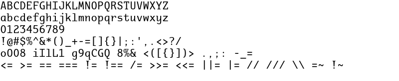

## Aglet Mono VF (Variable)
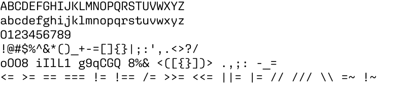

## Aglet Mono VF (Variable)
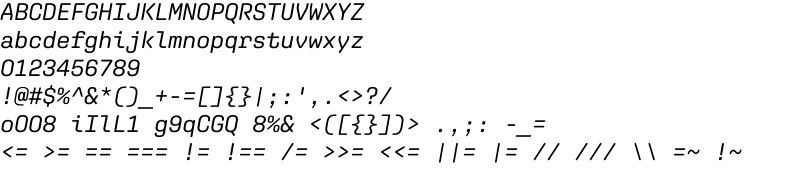

## Annotation Mono (Variable)

## Apparat Black
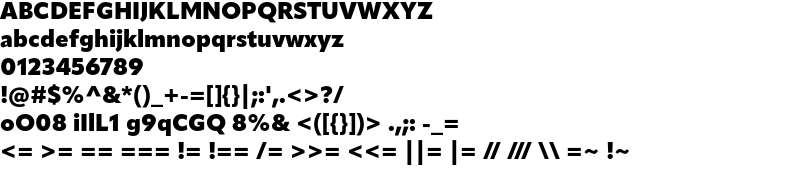

## Apparat Black Italic
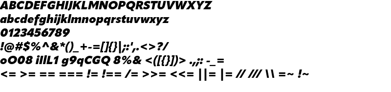

## Apparat Bold

## Apparat Bold Italic
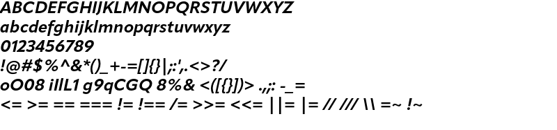

## Apparat Extrabold
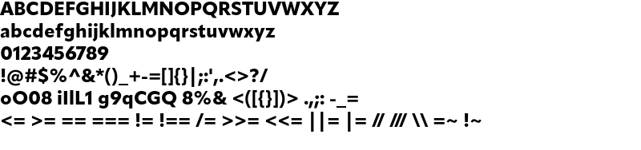

## Apparat Extrabold Italic

## Apparat Extralight

## Apparat Extralight Italic
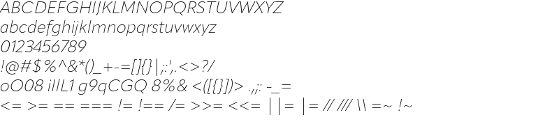

## Apparat Hairline
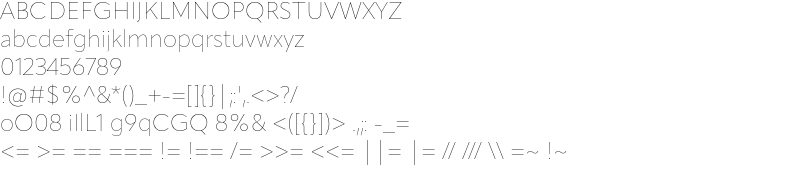

## Apparat Hairline Italic
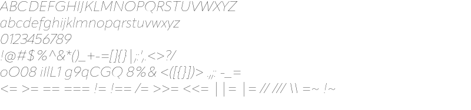

## Apparat Heavy

## Apparat Heavy Italic
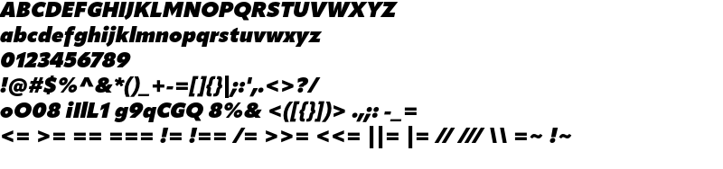

## Apparat Italic
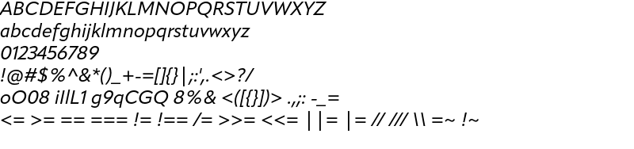

## Apparat Light
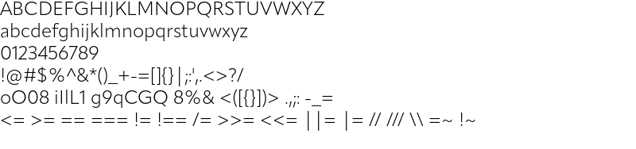

## Apparat Light Italic
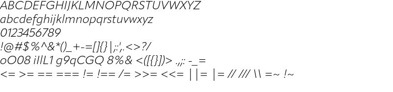

## Apparat Medium

## Apparat Medium Italic
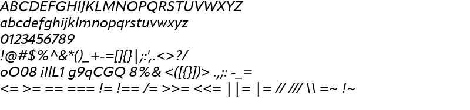

## Apparat Regular
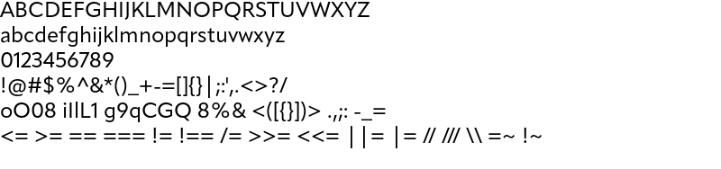

## Apparat Semibold
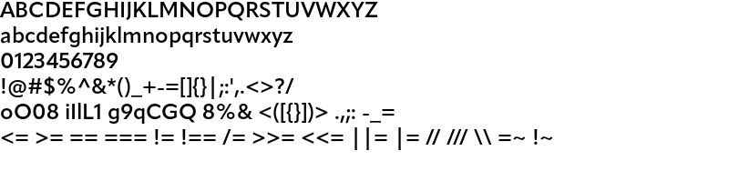

## Apparat Semibold Italic

## Apparat Thin

## Apparat Thin Italic
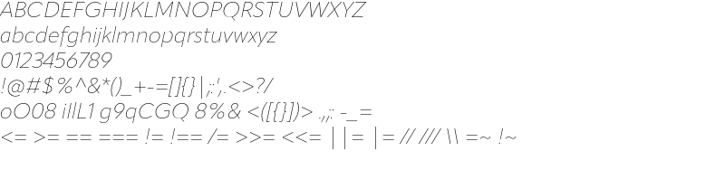

## Articulat CF Bold
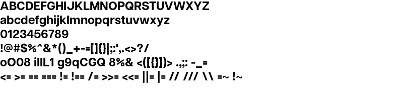

## Articulat CF Demi Bold
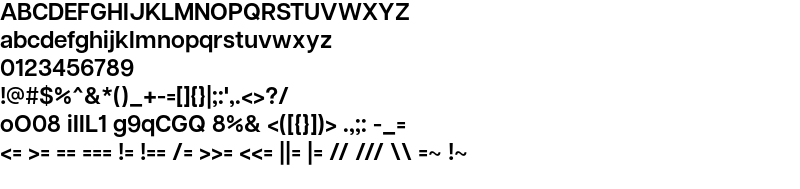

## Articulat CF Extra Bold

## Articulat CF Extra Light
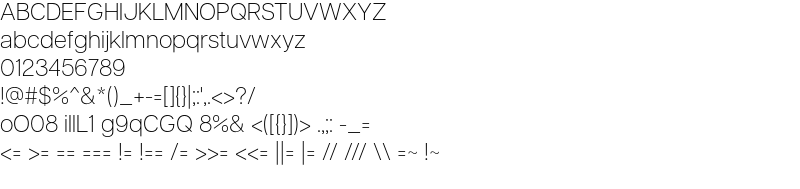

## Articulat CF Heavy
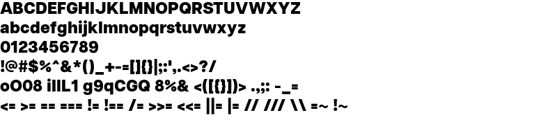

## Articulat CF Light
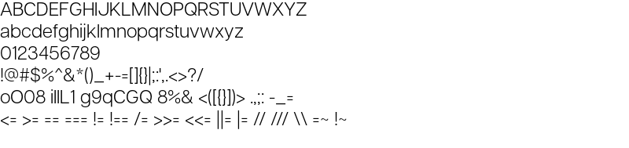

## Articulat CF Medium
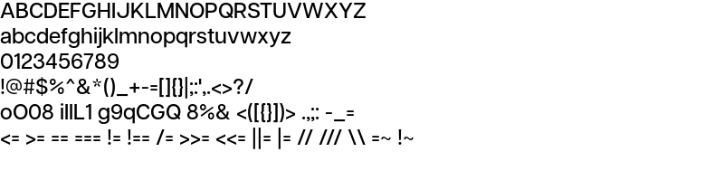

## Articulat CF Normal
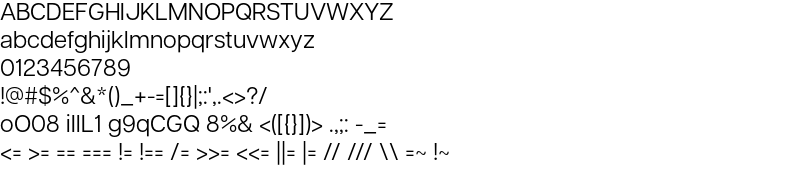

## Articulat CF Regular
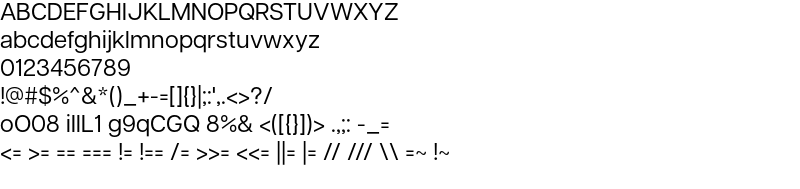

## Articulat CF Thin
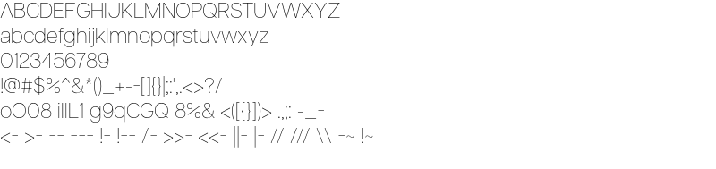

## Associate Mono Bold

## Associate Mono Bold Italic
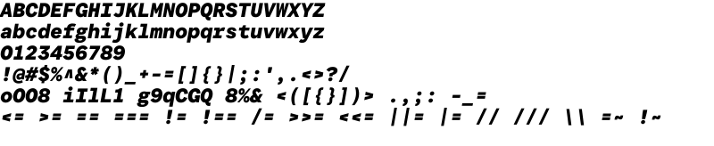

## Associate Mono Extralight

## Associate Mono Extralight Italic

## Associate Mono Italic

## Associate Mono Light

## Associate Mono Light Italic
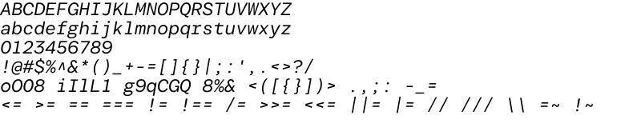

## Associate Mono Medium

## Associate Mono Medium Italic

## Associate Mono

## AtkinsonHyperlegible-Bold
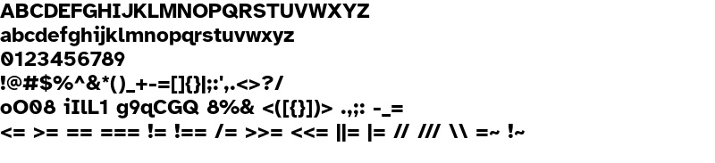

## AtkinsonHyperlegible-BoldItalic
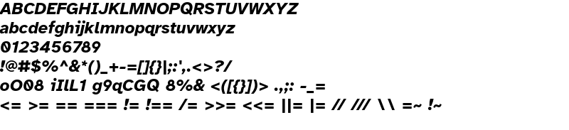

## AtkinsonHyperlegible-Italic
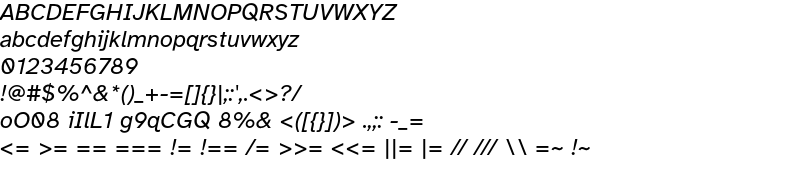

## AtkinsonHyperlegible-Regular
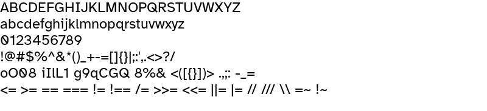

## Atkinson Hyperlegible Mono Bold

## Atkinson Hyperlegible Mono Bold Italic

## Atkinson Hyperlegible Mono ExtraBold
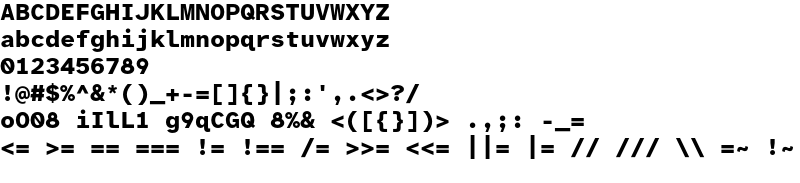

## Atkinson Hyperlegible Mono ExtraBold Italic
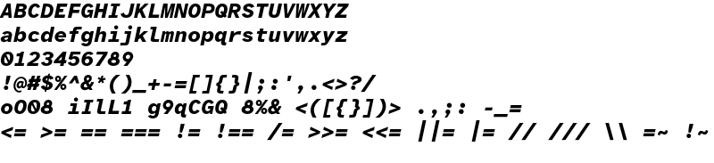

## Atkinson Hyperlegible Mono ExtraLight
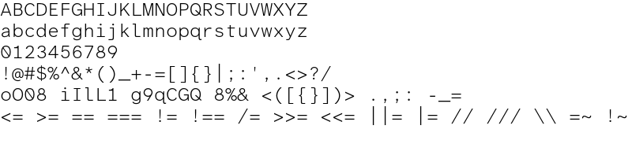

## Atkinson Hyperlegible Mono ExtraLight Italic

## Atkinson Hyperlegible Mono Light

## Atkinson Hyperlegible Mono Light Italic
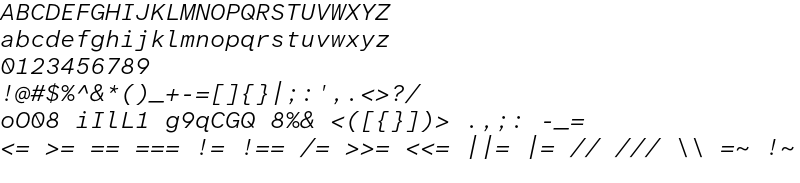

## Atkinson Hyperlegible Mono Medium

## Atkinson Hyperlegible Mono Medium Italic

## Atkinson Hyperlegible Mono Regular
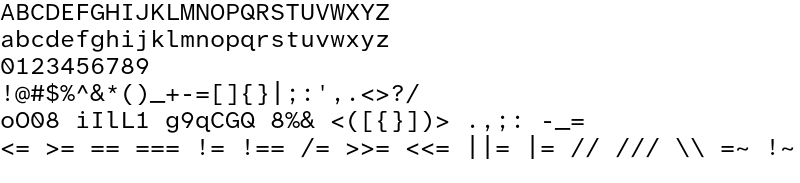

## Atkinson Hyperlegible Mono Regular Italic

## Atkinson Hyperlegible Mono SemiBold

## Atkinson Hyperlegible Mono SemiBold Italic

## Atkinson Hyperlegible Mono VF (Variable)

## Atkinson Hyperlegible Next Bold

## Atkinson Hyperlegible Next Bold Italic
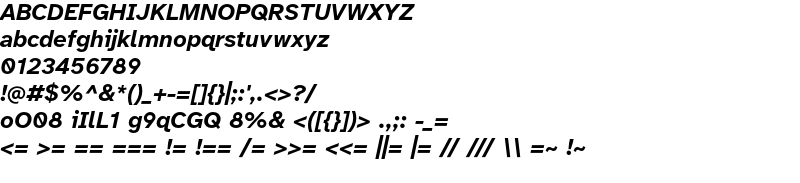

## Atkinson Hyperlegible Next ExtraBold
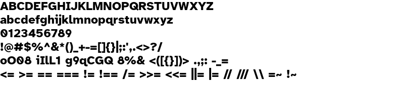

## Atkinson Hyperlegible Next ExtraBold Italic

## Atkinson Hyperlegible Next ExtraLight

## Atkinson Hyperlegible Next ExtraLight Italic

## Atkinson Hyperlegible Next Light

## Atkinson Hyperlegible Next Light Italic
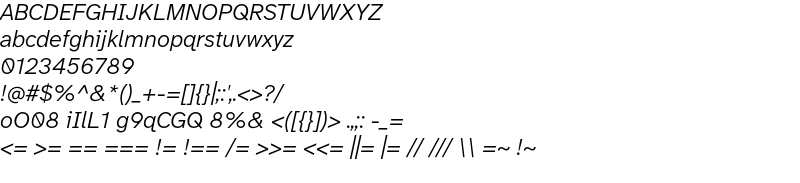

## Atkinson Hyperlegible Next Medium
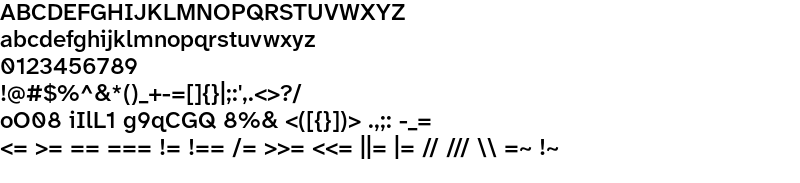

## Atkinson Hyperlegible Next Medium Italic

## Atkinson Hyperlegible Next Regular

## Atkinson Hyperlegible Next Regular Italic

## Atkinson Hyperlegible Next SemiBold

## Atkinson Hyperlegible Next SemiBold Italic
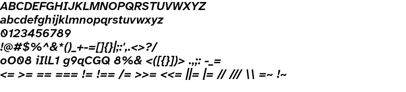

## Atkinson Hyperlegible Next VF (Variable)
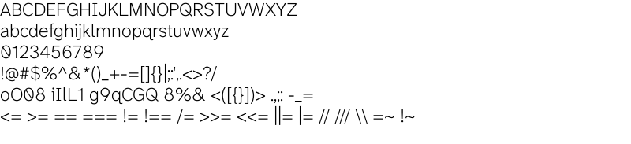

## Attribute Mono Black

## Attribute Mono Black Italic

## Attribute Mono Bold

## Attribute Mono Bold Italic
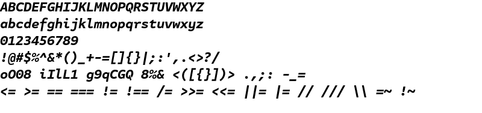

## Attribute Mono Italic

## Attribute Mono Light
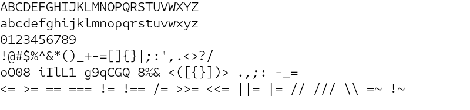

## Attribute Mono Light Italic
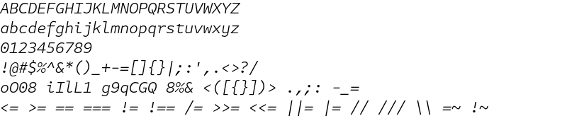

## Attribute Mono Medium
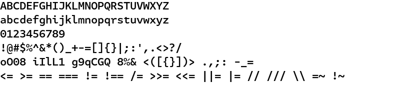

## Attribute Mono Medium Italic

## Attribute Mono

## Attribute Mono Thin

## Attribute Mono Thin Italic
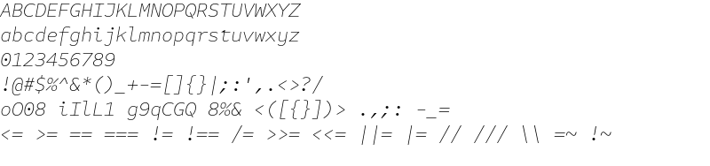

## Attribute Mono Xlight

## Attribute Mono Xlight Italic

## AudioLink Console Bold

## AudioLink Console Demi

## AudioLink Console Light
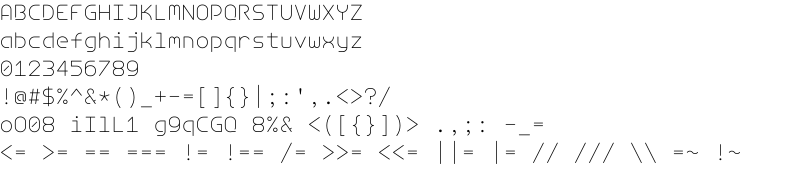

## AudioLink Console Medium

## AudioLink Console Regular

## AudioLink Mono Bold

## AudioLink Mono Demi

## AudioLink Mono Light

## AudioLink Mono Medium

## AudioLink Mono Regular

## Auger Mono Black

## Auger Mono Bold

## Auger Mono Light

## Auger Mono Medium

## Auger Mono Regular

## Auger Mono X-Light

## Barteldes Small Bold

## Barteldes Small Book

## Barteldes Small Extralight

## Barteldes Small Light

## Barteldes Small Medium

## Barteldes Small Semibold

## Basic Sans Black

## Basic Sans Black It

## Basic Sans Bold

## Basic Sans Bold It

## Basic Sans ExtraLight

## Basic Sans ExtraLight It

## Basic Sans Light

## Basic Sans Light It

## Basic Sans Regular

## Basic Sans Regular It

## Basic Sans SemiBold

## Basic Sans SemiBold It

## Basic Sans Thin

## Basic Sans Thin It

## Berkeley Mono Bold

## Berkeley Mono Bold Italic

## Berkeley Mono Italic

## Berkeley Mono Regular

## Berkeley Mono Variable (Variable)

## Berkeley Mono Variable (Variable)

## BerkeleyMono Nerd Font Bold

## BerkeleyMono Nerd Font Bold Italic

## BerkeleyMono Nerd Font Italic

## BerkeleyMono Nerd Font

## Blender Pro Bold

## Blender Pro Bold Italic

## Blender Pro Book

## Blender Pro Book Italic

## Blender Pro Heavy

## Blender Pro Medium

## Blender Pro Medium Italic

## Blender Pro Thin

## Blender Pro Thin Italic

## Cairo Black

## Cairo Bold

## Cairo Bold Italic

## Cairo ExtraLight

## Cairo ExtraLight Italic

## Cairo Italic

## Cairo Light

## Cairo Light Italic

## Cairo Regular

## Cairo SemiBold

## Cairo SemiBold Italic

## Calibri Bold

## Calibri Bold Italic

## Calibri Italic

## Calibri

## Calling Code Bold

## Calling Code Bold Italic

## Calling Code Italic

## Calling Code Regular

## Cambria Bold

## Cambria Bold Italic

## Cambria Italic

## Cambria

## CamingoCode Bold

## CamingoCode Bold Italic

## CamingoCode Italic

## CamingoCode Regular

## Candara Bold

## Candara Bold Italic

## Candara Italic

## Candara

## Carbon-Bold

## Carbon-BoldItalic

## Carbon-Regular

## Carbon-RegularItalic

## Carbon-Thin

## Carbon-ThinItalic

## Cartograph CF Bold

## Cartograph CF Bold Italic

## Cartograph CF Demi Bold

## Cartograph CF Demi Bold Italic

## Cartograph CF Extra Bold

## Cartograph CF Extra Bold Italic

## Cartograph CF Extra Light

## Cartograph CF Extra Light Italic

## Cartograph CF Heavy

## Cartograph CF Heavy Italic

## Cartograph CF Light

## Cartograph CF Light Italic

## Cartograph CF Regular

## Cartograph CF Regular Italic

## Cartograph CF Thin

## Cartograph CF Thin Italic

## Consolas Bold

## Consolas Bold Italic

## Consolas Italic

## Consolas

## Constantia Bold

## Constantia Bold Italic

## Constantia Italic

## Constantia

## Corbel Bold

## Corbel Bold Italic

## Corbel Italic

## Corbel

## CourierPrime-Bold

## CourierPrime-BoldItalic

## CourierPrime-Italic

## CourierPrime

## Degular Mono Black

## Degular Mono Black Italic

## Degular Mono Bold

## Degular Mono Bold Italic

## Degular Mono Italic

## Degular Mono Light

## Degular Mono Light Italic

## Degular Mono Medium

## Degular Mono Medium Italic

## Degular Mono Regular

## Degular Mono Semibold

## Degular Mono Semibold Italic

## Degular Mono Thin

## Degular Mono Thin Italic

## Dico Code Two Bold

## Dico Code Two Bold Italic

## Dico Code Two Italic

## Dico Code Two

## Divenire Mono Black

## Divenire Mono Black Italic

## Divenire Mono Bold

## Divenire Mono Bold Italic

## Divenire Mono ExtraBold

## Divenire Mono ExtraBold Italic

## Divenire Mono Light

## Divenire Mono Light Italic

## Divenire Mono Medium

## Divenire Mono Medium Italic

## Divenire Mono Regular

## Divenire Mono Regular Italic

## Ellograph CF Bold

## Ellograph CF Bold Italic

## Ellograph CF Demi Bold

## Ellograph CF Demi Bold Italic

## Ellograph CF Extra Bold

## Ellograph CF Extra Bold Italic

## Ellograph CF Extra Light

## Ellograph CF Extra Light Italic

## Ellograph CF Heavy

## Ellograph CF Heavy Italic

## Ellograph CF Italic

## Ellograph CF Light

## Ellograph CF Light Italic

## Ellograph CF

## Ellograph CF Thin

## Ellograph CF Thin Italic

## Encode Sans (Variable)

## Encode Sans SC (Variable)

## EssonnesDisplay-Italic

## EssonnesDisplay-Light

## EssonnesDisplay-LightItalic

## EssonnesDisplay-Regular

## EversonMono-Bold

## EversonMono-BoldOblique

## EversonMono-Oblique

## EversonMono

## ExpresswayRg-Bold

## ExpresswayRg-BoldItalic

## ExpresswayBk-Regular

## ExpresswayBk-Italic

## ExpresswayXb-Regular

## ExpresswayXb-Italic

## ExpresswayXl-Regular

## ExpresswayXl-Italic

## ExpresswayLt-Regular

## ExpresswayLt-Italic

## ExpresswayRg-Regular

## ExpresswayRg-Italic

## ExpresswaySb-Regular

## ExpresswaySb-Italic

## Fira Code (Variable)

## Fira Sans Black

## Fira Sans Black Italic

## Fira Sans Bold

## Fira Sans Bold Italic

## Fira Sans ExtraBold

## Fira Sans ExtraBold Italic

## Fira Sans ExtraLight

## Fira Sans ExtraLight Italic

## Fira Sans Italic

## Fira Sans Light

## Fira Sans Light Italic

## Fira Sans Medium

## Fira Sans Medium Italic

## Fira Sans Regular

## Fira Sans SemiBold

## Fira Sans SemiBold Italic

## Fira Sans Thin

## Fira Sans Thin Italic

## Font Awesome 6 Brands Regular

## Font Awesome 6 Free Regular

## Font Awesome 6 Free Solid

## Foreday Sans Black

## Foreday Sans Black Italic

## Foreday Sans Bold

## Foreday Sans Bold Italic

## Foreday Sans Book

## Foreday Sans Book Italic

## Foreday Sans ExtraBold

## Foreday Sans ExtraBold Italic

## Foreday Sans Light

## Foreday Sans Light Italic

## Foreday Sans Medium

## Foreday Sans Medium Italic

## Forma DJR Display Bold

## Forma DJR Display Bold Italic

## FormaDJRDisplay Medium Regular

## FormaDJRDisplay Medium Italic

## Forma DJR Mono Bk

## Forma DJR Mono Bk It

## Forma DJR Mono Bold

## Forma DJR Mono Bold It

## Forma DJR Mono Ex Bold

## Forma DJR Mono Ex Bold It

## Forma DJR Mono Ex Lt

## Forma DJR Mono Ex Lt It

## Forma DJR Mono Hair

## Forma DJR Mono Hair It

## Forma DJR Mono It

## Forma DJR Mono Lt

## Forma DJR Mono Lt It

## Forma DJR Mono Md

## Forma DJR Mono Md It

## Forma DJR Mono Regular

## Forma DJR Mono Thin

## Forma DJR Mono Thin It

## Fragment Mono Italic

## Fragment Mono Regular

## Fragment Mono Italic

## Fragment Mono Regular

## Geist Mono Black

## Geist Mono Bold

## Geist Mono Light

## Geist Mono Medium

## Geist Mono Regular

## Geist Mono SemiBold

## Geist Mono Thin

## Geist Mono UltraBlack

## Geist Mono UltraLight

## Geist Mono (Variable)

## Gesta-Bold

## Gesta-BoldItalic

## Gesta-Italic

## Gesta-Light

## Gesta-LightItalic

## Gesta-Medium

## Gesta-MediumItalic

## Gesta-Regular

## GoodHeadlinePro-Wide

## GoodHeadlinePro-WideBlack

## GoodHeadlinePro-WideBlackItalic

## GoodHeadlinePro-WideBold

## GoodHeadlinePro-WideBoldItalic

## GoodHeadlinePro-WideItalic

## GoodHeadlinePro-WideLight

## GoodHeadlinePro-WideLightItalic

## GoodHeadlinePro-WideMedium

## GoodHeadlinePro-WideMediumItalic

## GoodHeadlinePro-WideNews

## GoodHeadlinePro-WideNewsItalic

## GoodHeadlinePro-WideUltra

## GoodHeadlinePro-WideUltraItalic

## Hack Bold

## Hack Bold Italic

## Hack Italic

## Hack Regular

## Halyard Display (Variable)

## Halyard Display (Variable)

## Halyard Micro (Variable)

## Halyard Micro (Variable)

## Halyard Text (Variable)

## Halyard Text (Variable)

## Hasklig Black

## Hasklig Black Italic

## Hasklig Bold

## Hasklig Bold Italic

## Hasklig ExtraLight

## Hasklig ExtraLight Italic

## Hasklig Italic

## Hasklig Light

## Hasklig Light Italic

## Hasklig Medium

## Hasklig Medium Italic

## Hasklig

## Hasklig Semibold

## Hasklig Semibold Italic

## Hasklig Black

## Hasklig Black Italic

## Hasklig Bold

## Hasklig Bold Italic

## Hasklig ExtraLight

## Hasklig ExtraLight Italic

## Hasklig Italic

## Hasklig Light

## Hasklig Light Italic

## Hasklig Medium

## Hasklig Medium Italic

## Hasklig

## Hasklig Semibold

## Hasklig Semibold Italic

## IBM Plex Mono Bold

## IBM Plex Mono Bold Italic

## IBM Plex Mono ExtLt

## IBM Plex Mono ExtLt Italic

## IBM Plex Mono Italic

## IBM Plex Mono Light

## IBM Plex Mono Light Italic

## IBM Plex Mono Medm

## IBM Plex Mono Medm Italic

## IBM Plex Mono

## IBM Plex Mono SmBld

## IBM Plex Mono SmBld Italic

## IBM Plex Mono Text

## IBM Plex Mono Text Italic

## IBM Plex Mono Thin

## IBM Plex Mono Thin Italic

## IBM Plex Mono Bold

## IBM Plex Mono Bold Italic

## IBM Plex Mono ExtLt

## IBM Plex Mono ExtLt Italic

## IBM Plex Mono Italic

## IBM Plex Mono Light

## IBM Plex Mono Light Italic

## IBM Plex Mono Medm

## IBM Plex Mono Medm Italic

## IBM Plex Mono

## IBM Plex Mono SmBld

## IBM Plex Mono SmBld Italic

## IBM Plex Mono Text

## IBM Plex Mono Text Italic

## IBM Plex Mono Thin

## IBM Plex Mono Thin Italic

## IBM Plex Sans Bold

## IBM Plex Sans Bold Italic

## IBM Plex Sans ExtLt

## IBM Plex Sans ExtLt Italic

## IBM Plex Sans Italic

## IBM Plex Sans Light

## IBM Plex Sans Light Italic

## IBM Plex Sans Medm

## IBM Plex Sans Medm Italic

## IBM Plex Sans

## IBM Plex Sans SmBld

## IBM Plex Sans SmBld Italic

## IBM Plex Sans Text

## IBM Plex Sans Text Italic

## IBM Plex Sans Thin

## IBM Plex Sans Thin Italic

## IBM Plex Sans Bold

## IBM Plex Sans Bold Italic

## IBM Plex Sans ExtLt

## IBM Plex Sans ExtLt Italic

## IBM Plex Sans Italic

## IBM Plex Sans Light

## IBM Plex Sans Light Italic

## IBM Plex Sans Medm

## IBM Plex Sans Medm Italic

## IBM Plex Sans

## IBM Plex Sans SmBld

## IBM Plex Sans SmBld Italic

## IBM Plex Sans Text

## IBM Plex Sans Text Italic

## IBM Plex Sans Thin

## IBM Plex Sans Thin Italic

## IBM Plex Serif Bold

## IBM Plex Serif Bold Italic

## IBM Plex Serif ExtLt

## IBM Plex Serif ExtLt Italic

## IBM Plex Serif Italic

## IBM Plex Serif Light

## IBM Plex Serif Light Italic

## IBM Plex Serif Medm

## IBM Plex Serif Medm Italic

## IBM Plex Serif

## IBM Plex Serif SmBld

## IBM Plex Serif SmBld Italic

## IBM Plex Serif Text

## IBM Plex Serif Text Italic

## IBM Plex Serif Thin

## IBM Plex Serif Thin Italic

## IBM Plex Serif Bold

## IBM Plex Serif Bold Italic

## IBM Plex Serif ExtLt

## IBM Plex Serif ExtLt Italic

## IBM Plex Serif Italic

## IBM Plex Serif Light

## IBM Plex Serif Light Italic

## IBM Plex Serif Medm

## IBM Plex Serif Medm Italic

## IBM Plex Serif

## IBM Plex Serif SmBld

## IBM Plex Serif SmBld Italic

## IBM Plex Serif Text

## IBM Plex Serif Text Italic

## IBM Plex Serif Thin

## IBM Plex Serif Thin Italic

## Iki Mono VF (Variable)

## Iki Mono VF (Variable)

## Ingra Light

## Ingra Medium

## Ingra UltraLight

## InputMono Black

## InputMono BlackIta

## InputMono Bold

## InputMono BoldIta

## InputMono ExLight

## InputMono ExLightIta

## InputMono Italic

## InputMono Light

## InputMono LightIta

## InputMono Medium

## InputMono MediumIta

## InputMono

## InputMono Thin

## InputMono ThinIta

## InputMonoCompressed Black

## InputMonoCompressed BlackIta

## InputMonoCompressed Bold

## InputMonoCompressed BoldIta

## InputMonoCompressed ExLight

## InputMonoCompressed ExLightIta

## InputMonoCompressed Italic

## InputMonoCompressed Light

## InputMonoCompressed LightIta

## InputMonoCompressed Medium

## InputMonoCompressed MediumIta

## InputMonoCompressed

## InputMonoCompressed Thin

## InputMonoCompressed ThinIta

## InputMonoNarrow Black

## InputMonoNarrow BlackIta

## InputMonoNarrow Bold

## InputMonoNarrow BoldIta

## InputMonoNarrow ExLight

## InputMonoNarrow ExLightIta

## InputMonoNarrow Italic

## InputMonoNarrow Light

## InputMonoNarrow LightIta

## InputMonoNarrow Medium

## InputMonoNarrow MediumIta

## InputMonoNarrow

## InputMonoNarrow Thin

## InputMonoNarrow ThinIta

## InputSans Black

## InputSans BlackIta

## InputSans Bold

## InputSans BoldIta

## InputSans ExLight

## InputSans ExLightIta

## InputSans Italic

## InputSans Light

## InputSans LightIta

## InputSans Medium

## InputSans MediumIta

## InputSans

## InputSans Thin

## InputSans ThinIta

## InputSansCompressed Black

## InputSansCompressed BlackIta

## InputSansCompressed Bold

## InputSansCompressed BoldIta

## InputSansCompressed ExLight

## InputSansCompressed ExLightIta

## InputSansCompressed Italic

## InputSansCompressed Light

## InputSansCompressed LightIta

## InputSansCompressed Medium

## InputSansCompressed MediumIta

## InputSansCompressed

## InputSansCompressed Thin

## InputSansCompressed ThinIta

## InputSansNarrow Black

## InputSansNarrow BlackIta

## InputSansNarrow Bold

## InputSansNarrow BoldIta

## InputSansNarrow ExLight

## InputSansNarrow ExLightIta

## InputSansNarrow Italic

## InputSansNarrow Light

## InputSansNarrow LightIta

## InputSansNarrow Medium

## InputSansNarrow MediumIta

## InputSansNarrow

## InputSansNarrow Thin

## InputSansNarrow ThinIta

## InputSerif Black

## InputSerif BlackIta

## InputSerif Bold

## InputSerif BoldIta

## InputSerif ExLight

## InputSerif ExLightIta

## InputSerif Italic

## InputSerif Light

## InputSerif LightIta

## InputSerif Medium

## InputSerif MediumIta

## InputSerif

## InputSerif Thin

## InputSerif ThinIta

## InputSerifCompressed Black

## InputSerifCompressed BlackIta

## InputSerifCompressed Bold

## InputSerifCompressed BoldIta

## InputSerifCompressed ExLight

## InputSerifCompressed ExLightIta

## InputSerifCompressed Italic

## InputSerifCompressed Light

## InputSerifCompressed LightIta

## InputSerifCompressed Medium

## InputSerifCompressed MediumIta

## InputSerifCompressed

## InputSerifCompressed Thin

## InputSerifCompressed ThinIta

## InputSerifNarrow Black

## InputSerifNarrow BlackIta

## InputSerifNarrow Bold

## InputSerifNarrow BoldIta

## InputSerifNarrow ExLight

## InputSerifNarrow ExLightIta

## InputSerifNarrow Italic

## InputSerifNarrow Light

## InputSerifNarrow LightIta

## InputSerifNarrow Medium

## InputSerifNarrow MediumIta

## InputSerifNarrow

## InputSerifNarrow Thin

## InputSerifNarrow ThinIta

## Intel One Mono Bold

## Intel One Mono Bold Italic

## Intel One Mono Italic

## Intel One Mono Light

## Intel One Mono Light Italic

## Intel One Mono Medium

## Intel One Mono Medium Italic

## Intel One Mono

## Interstate Black

## Interstate Black Italic

## Interstate Bold

## Interstate Bold Italic

## Interstate ExLight

## Interstate ExLight Italic

## Interstate Hairline

## Interstate Hairline Italic

## Interstate Italic

## Interstate Light

## Interstate Light Italic

## Interstate

## Interstate Thin

## Interstate Thin Italic

## Interstate UltraBlack

## Interstate UltraBlack Italic

## Ioskeley Mono Bold

## Ioskeley Mono Bold Italic

## Ioskeley Mono Extrabold

## Ioskeley Mono Extrabold Italic

## Ioskeley Mono Italic

## Ioskeley Mono Light

## Ioskeley Mono Light Italic

## Ioskeley Mono Medium

## Ioskeley Mono Medium Italic

## Ioskeley Mono

## Ioskeley Mono Semibold

## Ioskeley Mono Semibold Italic

## JetBrains Mono (Variable)

## JetBrains Mono (Variable)

## JetBrains Mono NL Bold

## JetBrains Mono NL Bold Italic

## JetBrains Mono NL ExtraBold

## JetBrains Mono NL ExtraBold Italic

## JetBrains Mono NL ExtraLight

## JetBrains Mono NL ExtraLight Italic

## JetBrains Mono NL Italic

## JetBrains Mono NL Light

## JetBrains Mono NL Light Italic

## JetBrains Mono NL Medium

## JetBrains Mono NL Medium Italic

## JetBrains Mono NL Regular

## JetBrains Mono NL SemiBold

## JetBrains Mono NL SemiBold Italic

## JetBrains Mono NL Thin

## JetBrains Mono NL Thin Italic

## Kopius-Black

## Kopius Black Italic

## Kopius-Book

## Kopius Book Italic

## Kopius-Extrabold

## Kopius Extrabold Italic

## Kopius-Light

## Kopius Light Italic

## KopiusExtras-BoxHeadings

## KopiusExtras-Labels

## Lato Black

## Lato Black Italic

## Lato Bold

## Lato Bold Italic

## Lato-Hairline

## Lato-HairlineItalic

## Lato Italic

## Lato-Light

## Lato-LightItalic

## Lato Regular

## LetterGothicStd-Bold

## LetterGothicStd-BoldSlanted

## LetterGothicStd-Slanted

## LetterGothicStd

## Logic Monoscript Black

## Logic Monoscript Bold

## Logic Monoscript Light

## Logic Monoscript Medium

## Logic Monoscript

## Logic Monospace Black

## Logic Monospace Black Italic

## Logic Monospace Bold

## Logic Monospace Bold Italic

## Logic Monospace Italic

## Logic Monospace Light

## Logic Monospace Light Italic

## Logic Monospace Medium

## Logic Monospace Medium Italic

## Logic Monospace

## Maple Mono Bold

## Maple Mono BoldItalic

## Maple Mono Italic

## Maple Mono Light

## Maple Mono LightItalic

## Maple Mono Regular

## Maple Mono Bold

## Maple Mono BoldItalic

## Maple Mono Italic

## Maple Mono Light

## Maple Mono LightItalic

## Maple Mono Regular

## Maple Mono NF Bold

## Maple Mono NF BoldItalic

## Maple Mono NF Italic

## Maple Mono NF Light

## Maple Mono NF LightItalic

## Maple Mono NF Regular

## Method Mono Black

## Method Mono Black Italic

## Method Mono Bold

## Method Mono Bold Italic

## Method Mono Italic

## Method Mono Light

## Method Mono Light Italic

## Method Mono Regular

## Minion 3 Display Bold

## Minion 3 Display Bold Italic

## Minion 3 Display Italic

## Minion 3 Display Medium

## Minion 3 Display Medium Italic

## Minion 3 Display

## Minion 3 Display Semibold

## Minion 3 Display Semibold Italic

## Monaspace Argon Bold

## Monaspace Argon Bold Italic

## Monaspace Argon ExtraBold

## Monaspace Argon ExtraBold Italic

## Monaspace Argon ExtraLight

## Monaspace Argon ExtraLight Italic

## Monaspace Argon Italic

## Monaspace Argon Light

## Monaspace Argon Light Italic

## Monaspace Argon Medium

## Monaspace Argon Medium Italic

## Monaspace Argon Regular

## Monaspace Argon SemiBold

## Monaspace Argon SemiBold Italic

## Monaspace Argon SemiWide Bold

## Monaspace Argon SemiWide Bold Italic

## Monaspace Argon SemiWide ExtraBold

## Monaspace Argon SemiWide ExtraBold Italic

## Monaspace Argon SemiWide ExtraLight

## Monaspace Argon SemiWide ExtraLight Italic

## Monaspace Argon SemiWide Italic

## Monaspace Argon SemiWide Light

## Monaspace Argon SemiWide Light Italic

## Monaspace Argon SemiWide Medium

## Monaspace Argon SemiWide Medium Italic

## Monaspace Argon SemiWide Regular

## Monaspace Argon SemiWide SemiBold

## Monaspace Argon SemiWide SemiBold Italic

## Monaspace Argon Wide Bold

## Monaspace Argon Wide Bold Italic

## Monaspace Argon Wide ExtraBold

## Monaspace Argon Wide ExtraBold Italic

## Monaspace Argon Wide ExtraLight

## Monaspace Argon Wide ExtraLight Italic

## Monaspace Argon Wide Italic

## Monaspace Argon Wide Light

## Monaspace Argon Wide Light Italic

## Monaspace Argon Wide Medium

## Monaspace Argon Wide Medium Italic

## Monaspace Argon Wide Regular

## Monaspace Argon Wide SemiBold

## Monaspace Argon Wide SemiBold Italic

## Monaspace Argon Var (Variable)

## Monaspace Krypton Bold

## Monaspace Krypton Bold Italic

## Monaspace Krypton ExtraBold

## Monaspace Krypton ExtraBold Italic

## Monaspace Krypton ExtraLight

## Monaspace Krypton ExtraLight Italic

## Monaspace Krypton Italic

## Monaspace Krypton Light

## Monaspace Krypton Light Italic

## Monaspace Krypton Medium

## Monaspace Krypton Medium Italic

## Monaspace Krypton Regular

## Monaspace Krypton SemiBold

## Monaspace Krypton SemiBold Italic

## Monaspace Krypton SemiWide Bold

## Monaspace Krypton SemiWide Bold Italic

## Monaspace Krypton SemiWide ExtraBold

## Monaspace Krypton SemiWide ExtraBold Italic

## Monaspace Krypton SemiWide ExtraLight

## Monaspace Krypton SemiWide ExtraLight Italic

## Monaspace Krypton SemiWide Italic

## Monaspace Krypton SemiWide Light

## Monaspace Krypton SemiWide Light Italic

## Monaspace Krypton SemiWide Medium

## Monaspace Krypton SemiWide Medium Italic

## Monaspace Krypton SemiWide Regular

## Monaspace Krypton SemiWide SemiBold

## Monaspace Krypton SemiWide SemiBold Italic

## Monaspace Krypton Wide Bold

## Monaspace Krypton Wide Bold Italic

## Monaspace Krypton Wide ExtraBold

## Monaspace Krypton Wide ExtraBold Italic

## Monaspace Krypton Wide ExtraLight

## Monaspace Krypton Wide ExtraLight Italic

## Monaspace Krypton Wide Italic

## Monaspace Krypton Wide Light

## Monaspace Krypton Wide Light Italic

## Monaspace Krypton Wide Medium

## Monaspace Krypton Wide Medium Italic

## Monaspace Krypton Wide Regular

## Monaspace Krypton Wide SemiBold

## Monaspace Krypton Wide SemiBold Italic

## Monaspace Krypton Var (Variable)

## Monaspace Neon Bold

## Monaspace Neon Bold Italic

## Monaspace Neon ExtraBold

## Monaspace Neon ExtraBold Italic

## Monaspace Neon ExtraLight

## Monaspace Neon ExtraLight Italic

## Monaspace Neon Italic

## Monaspace Neon Light

## Monaspace Neon Light Italic

## Monaspace Neon Medium

## Monaspace Neon Medium Italic

## Monaspace Neon Regular

## Monaspace Neon SemiBold

## Monaspace Neon SemiBold Italic

## Monaspace Neon SemiWide Bold

## Monaspace Neon SemiWide Bold Italic

## Monaspace Neon SemiWide ExtraBold

## Monaspace Neon SemiWide ExtraBold Italic

## Monaspace Neon SemiWide ExtraLight

## Monaspace Neon SemiWide ExtraLight Italic

## Monaspace Neon SemiWide Italic

## Monaspace Neon SemiWide Light

## Monaspace Neon SemiWide Light Italic

## Monaspace Neon SemiWide Medium

## Monaspace Neon SemiWide Medium Italic

## Monaspace Neon SemiWide Regular

## Monaspace Neon SemiWide SemiBold

## Monaspace Neon SemiWide SemiBold Italic

## Monaspace Neon Wide Bold

## Monaspace Neon Wide Bold Italic

## Monaspace Neon Wide ExtraBold

## Monaspace Neon Wide ExtraBold Italic

## Monaspace Neon Wide ExtraLight

## Monaspace Neon Wide ExtraLight Italic

## Monaspace Neon Wide Italic

## Monaspace Neon Wide Light

## Monaspace Neon Wide Light Italic

## Monaspace Neon Wide Medium

## Monaspace Neon Wide Medium Italic

## Monaspace Neon Wide Regular

## Monaspace Neon Wide SemiBold

## Monaspace Neon Wide SemiBold Italic

## Monaspace Neon Var (Variable)

## Monaspace Radon Bold

## Monaspace Radon Bold Italic

## Monaspace Radon ExtraBold

## Monaspace Radon ExtraBold Italic

## Monaspace Radon ExtraLight

## Monaspace Radon ExtraLight Italic

## Monaspace Radon Italic

## Monaspace Radon Light

## Monaspace Radon Light Italic

## Monaspace Radon Medium

## Monaspace Radon Medium Italic

## Monaspace Radon Regular

## Monaspace Radon SemiBold

## Monaspace Radon SemiBold Italic

## Monaspace Radon SemiWide Bold

## Monaspace Radon SemiWide Bold Italic

## Monaspace Radon SemiWide ExtraBold

## Monaspace Radon SemiWide ExtraBold Italic

## Monaspace Radon SemiWide ExtraLight

## Monaspace Radon SemiWide ExtraLight Italic

## Monaspace Radon SemiWide Italic

## Monaspace Radon SemiWide Light

## Monaspace Radon SemiWide Light Italic

## Monaspace Radon SemiWide Medium

## Monaspace Radon SemiWide Medium Italic

## Monaspace Radon SemiWide Regular

## Monaspace Radon SemiWide SemiBold

## Monaspace Radon SemiWide SemiBold Italic

## Monaspace Radon Wide Bold

## Monaspace Radon Wide Bold Italic

## Monaspace Radon Wide ExtraBold

## Monaspace Radon Wide ExtraBold Italic

## Monaspace Radon Wide ExtraLight

## Monaspace Radon Wide ExtraLight Italic

## Monaspace Radon Wide Italic

## Monaspace Radon Wide Light

## Monaspace Radon Wide Light Italic

## Monaspace Radon Wide Medium

## Monaspace Radon Wide Medium Italic

## Monaspace Radon Wide Regular

## Monaspace Radon Wide SemiBold

## Monaspace Radon Wide SemiBold Italic

## Monaspace Radon Var (Variable)

## Monaspace Xenon Bold

## Monaspace Xenon Bold Italic

## Monaspace Xenon ExtraBold

## Monaspace Xenon ExtraBold Italic

## Monaspace Xenon ExtraLight

## Monaspace Xenon ExtraLight Italic

## Monaspace Xenon Italic

## Monaspace Xenon Light

## Monaspace Xenon Light Italic

## Monaspace Xenon Medium

## Monaspace Xenon Medium Italic

## Monaspace Xenon Regular

## Monaspace Xenon SemiBold

## Monaspace Xenon SemiBold Italic

## Monaspace Xenon SemiWide Bold

## Monaspace Xenon SemiWide Bold Italic

## Monaspace Xenon SemiWide ExtraBold

## Monaspace Xenon SemiWide ExtraBold Italic

## Monaspace Xenon SemiWide ExtraLight

## Monaspace Xenon SemiWide ExtraLight Italic

## Monaspace Xenon SemiWide Italic

## Monaspace Xenon SemiWide Light

## Monaspace Xenon SemiWide Light Italic

## Monaspace Xenon SemiWide Medium

## Monaspace Xenon SemiWide Medium Italic

## Monaspace Xenon SemiWide Regular

## Monaspace Xenon SemiWide SemiBold

## Monaspace Xenon SemiWide SemiBold Italic

## Monaspace Xenon Wide Bold

## Monaspace Xenon Wide Bold Italic

## Monaspace Xenon Wide ExtraBold

## Monaspace Xenon Wide ExtraBold Italic

## Monaspace Xenon Wide ExtraLight

## Monaspace Xenon Wide ExtraLight Italic

## Monaspace Xenon Wide Italic

## Monaspace Xenon Wide Light

## Monaspace Xenon Wide Light Italic

## Monaspace Xenon Wide Medium

## Monaspace Xenon Wide Medium Italic

## Monaspace Xenon Wide Regular

## Monaspace Xenon Wide SemiBold

## Monaspace Xenon Wide SemiBold Italic

## Monaspace Xenon Var (Variable)

## Monoflow Regular

## Monoflow Regular Italic

## Monoid Bold

## Monoid Italic

## Monoid Regular

## Monoid Retina

## Monoisome Regular

## Monotalic Bold

## Monotalic Light

## Monotalic Medium

## Monotalic Narrow

## Monotalic Narrow Bold

## Monotalic Narrow Light

## Monotalic Narrow Medium

## Monotalic Regular

## Monotalic Wide

## Monotalic Wide Bold

## Monotalic Wide Light

## Monotalic Wide Medium

## NanumGothicCoding-Bold

## NanumGothicCoding

## NeoSansW1G-Black

## NeoSansW1G-BlackItalic

## NeoSansW1G-Bold

## NeoSansW1G-BoldItalic

## NeoSansW1G-Italic

## NeoSansW1G-Light

## NeoSansW1G-LightItalic

## NeoSansW1G-Medium

## NeoSansW1G-MediumItalic

## NeoSansW1G-Regular

## NeoSansW1G-Ultra

## NeoSansW1G-UltraItalic

## New Science Mono Bold

## New Science Mono Light

## New Science Mono Medium

## New Science Mono Regular

## New Science Mono SemiBold

## New Science Mono Thin

## Noto Music Regular

## Noto Sans Black

## Noto Sans Black Italic

## Noto Sans Bold

## Noto Sans Bold Italic

## Noto Sans ExtraBold

## Noto Sans ExtraBold Italic

## Noto Sans ExtraLight

## Noto Sans ExtraLight Italic

## Noto Sans Italic

## Noto Sans Light

## Noto Sans Light Italic

## Noto Sans Medium

## Noto Sans Medium Italic

## Noto Sans Regular

## Noto Sans SemiBold

## Noto Sans SemiBold Italic

## Noto Sans Thin

## Noto Sans Thin Italic

## Noto Sans Display (Variable)

## Noto Sans Display (Variable)

## Noto Sans Math Regular

## Noto Sans Mono (Variable)

## Noto Sans SignWriting Regular

## Noto Sans Symbols (Variable)

## Noto Sans Symbols 2 Regular

## Noto Serif Bold

## Noto Serif Bold Italic

## Noto Serif Italic

## Noto Serif

## Noto Serif Display (Variable)

## Noto Serif Display (Variable)

## Officina Sans ITC Pro Bold

## Officina Sans ITC Pro Book

## Officina Sans ITC Pro Medium

## Ohno Softie Variable (Variable)

## Open Sans (Variable)

## Open Sans (Variable)

## Operator Mono Bold

## Operator Mono Bold Italic

## Operator Mono Book

## Operator Mono Book Italic

## Operator Mono XLight

## Operator Mono XLight Italic

## Operator Mono Light

## Operator Mono Light Italic

## Operator Mono Medium

## Operator Mono Medium Italic

## Operator Mono Lig Book

## Operator Mono Lig Book Italic

## Operator Mono Lig Light

## Operator Mono Lig Light Italic

## Operator Mono Bold Nerd Font Complete

## Operator Mono Bold Italic Nerd Font Complete

## Operator Mono Book Nerd Font Complete

## Operator Mono Book Italic Nerd Font Complete

## Operator Mono Extra Light Nerd Font Complete

## Operator Mono Extra Light Italic Nerd Font Complete

## Operator Mono Light Nerd Font Complete

## Operator Mono Light Italic Nerd Font Complete

## Operator Mono Medium Nerd Font Complete

## Operator Mono Medium Italic Nerd Font Complete

## Operator Mono SSm Bold

## Operator Mono SSm Bold Italic

## Operator Mono SSm Book

## Operator Mono SSm Book Italic

## Operator Mono SSm Light

## Operator Mono SSm Light Italic

## Operator Mono SSm Medium

## Operator Mono SSm Medium Italic

## Overlock Black

## Overlock Black Italic

## Overlock Bold

## Overlock Bold Italic

## Overlock Italic

## Overlock Regular

## ParadroidMono Soft Bold

## ParadroidMono Soft Bold Italic

## ParadroidMono Soft ExtraBold

## ParadroidMono Soft ExtraBold Italic

## ParadroidMono Soft Italic

## ParadroidMono Soft Light

## ParadroidMono Soft Light Italic

## ParadroidMono Soft Regular

## psudoFont Liga Mono Bold

## psudoFont Liga Mono Bold Italic

## psudoFont Liga Mono Italic

## psudoFont Liga Mono Regular

## PT Sans Pro Black

## PT Sans Pro Black Italic

## PT Sans Pro Bold

## PT Sans Pro Bold Italic

## PT Sans Pro Demi

## PT Sans Pro Demi Italic

## PT Sans Pro Extra Bold

## PT Sans Pro Extra Bold Italic

## PT Sans Pro Italic

## PT Sans Pro Light

## PT Sans Pro Light Italic

## PT Sans Pro

## Puffin Display Soft Blk

## Puffin Display Soft Blk Italic

## Puffin Display Soft Bold

## Puffin Display Soft Bold Italic

## Puffin Display Soft ExBd

## Puffin Display Soft ExBd Italic

## Puffin Display Soft Italic

## Puffin Display Soft Lt

## Puffin Display Soft Lt Italic

## Puffin Display Soft Medm

## Puffin Display Soft Medm Italic

## Puffin Display Soft

## Puffin Display Soft SmBd

## Puffin Display Soft SmBd Italic

## Rec Mono Casual Bold

## Rec Mono Casual Bold Italic

## Rec Mono Casual Italic

## Rec Mono Casual

## Rec Mono Duotone Bold

## Rec Mono Duotone Bold Italic

## Rec Mono Duotone Italic

## Rec Mono Duotone

## Rec Mono Linear Bold

## Rec Mono Linear Bold Italic

## Rec Mono Linear Italic

## Rec Mono Linear

## Rec Mono Semicasual Bold

## Rec Mono Semicasual Bold Italic

## Rec Mono Semicasual Italic

## Rec Mono Semicasual

## Recursive (Variable)

## Recursive Mn Csl St Blk

## Recursive Mn Csl St Blk Italic

## Recursive Mn Csl St Bold

## Recursive Mn Csl St Bold Italic

## Recursive Mn Csl St XBk

## Recursive Mn Csl St XBk Italic

## Recursive Mn Csl St XBd

## Recursive Mn Csl St XBd Italic

## Recursive Mn Csl St Italic

## Recursive Mn Csl St Lt

## Recursive Mn Csl St Lt Italic

## Recursive Mn Csl St Med

## Recursive Mn Csl St Med Italic

## Recursive Mn Csl St

## Recursive Mn Csl St SmB

## Recursive Mn Csl St SmB Italic

## Recursive Mn Csl St Blk

## Recursive Mn Csl St Blk Italic

## Recursive Mn Csl St Bold

## Recursive Mn Csl St Bold Italic

## Recursive Mn Csl St XBk

## Recursive Mn Csl St XBk Italic

## Recursive Mn Csl St XBd

## Recursive Mn Csl St XBd Italic

## Recursive Mn Csl St Italic

## Recursive Mn Csl St Lt

## Recursive Mn Csl St Lt Italic

## Recursive Mn Csl St Med

## Recursive Mn Csl St Med Italic

## Recursive Mn Csl St

## Recursive Mn Csl St SmB

## Recursive Mn Csl St SmB Italic

## Recursive Mn Lnr St Blk

## Recursive Mn Lnr St Blk Italic

## Recursive Mn Lnr St Bold

## Recursive Mn Lnr St Bold Italic

## Recursive Mn Lnr St XBk

## Recursive Mn Lnr St XBk Italic

## Recursive Mn Lnr St XBd

## Recursive Mn Lnr St XBd Italic

## Recursive Mn Lnr St Italic

## Recursive Mn Lnr St Lt

## Recursive Mn Lnr St Lt Italic

## Recursive Mn Lnr St Med

## Recursive Mn Lnr St Med Italic

## Recursive Mn Lnr St

## Recursive Mn Lnr St SmB

## Recursive Mn Lnr St SmB Italic

## Recursive Mn Lnr St Blk

## Recursive Mn Lnr St Blk Italic

## Recursive Mn Lnr St Bold

## Recursive Mn Lnr St Bold Italic

## Recursive Mn Lnr St XBk

## Recursive Mn Lnr St XBk Italic

## Recursive Mn Lnr St XBd

## Recursive Mn Lnr St XBd Italic

## Recursive Mn Lnr St Italic

## Recursive Mn Lnr St Lt

## Recursive Mn Lnr St Lt Italic

## Recursive Mn Lnr St Med

## Recursive Mn Lnr St Med Italic

## Recursive Mn Lnr St

## Recursive Mn Lnr St SmB

## Recursive Mn Lnr St SmB Italic

## Recursive Sn Csl St Blk

## Recursive Sn Csl St Blk Italic

## Recursive Sn Csl St Bold

## Recursive Sn Csl St Bold Italic

## Recursive Sn Csl St XBk

## Recursive Sn Csl St XBk Italic

## Recursive Sn Csl St XBd

## Recursive Sn Csl St XBd Italic

## Recursive Sn Csl St Italic

## Recursive Sn Csl St Lt

## Recursive Sn Csl St Lt Italic

## Recursive Sn Csl St Med

## Recursive Sn Csl St Med Italic

## Recursive Sn Csl St

## Recursive Sn Csl St SmB

## Recursive Sn Csl St SmB Italic

## Recursive Sn Csl St Blk

## Recursive Sn Csl St Blk Italic

## Recursive Sn Csl St Bold

## Recursive Sn Csl St Bold Italic

## Recursive Sn Csl St XBk

## Recursive Sn Csl St XBk Italic

## Recursive Sn Csl St XBd

## Recursive Sn Csl St XBd Italic

## Recursive Sn Csl St Italic

## Recursive Sn Csl St Lt

## Recursive Sn Csl St Lt Italic

## Recursive Sn Csl St Med

## Recursive Sn Csl St Med Italic

## Recursive Sn Csl St

## Recursive Sn Csl St SmB

## Recursive Sn Csl St SmB Italic

## Recursive Sn Lnr St Blk

## Recursive Sn Lnr St Blk Italic

## Recursive Sn Lnr St Bold

## Recursive Sn Lnr St Bold Italic

## Recursive Sn Lnr St XBk

## Recursive Sn Lnr St XBk Italic

## Recursive Sn Lnr St XBd

## Recursive Sn Lnr St XBd Italic

## Recursive Sn Lnr St Italic

## Recursive Sn Lnr St Lt

## Recursive Sn Lnr St Lt Italic

## Recursive Sn Lnr St Med

## Recursive Sn Lnr St Med Italic

## Recursive Sn Lnr St

## Recursive Sn Lnr St SmB

## Recursive Sn Lnr St SmB Italic

## Recursive Sn Lnr St Blk

## Recursive Sn Lnr St Blk Italic

## Recursive Sn Lnr St Bold

## Recursive Sn Lnr St Bold Italic

## Recursive Sn Lnr St XBk

## Recursive Sn Lnr St XBk Italic

## Recursive Sn Lnr St XBd

## Recursive Sn Lnr St XBd Italic

## Recursive Sn Lnr St Italic

## Recursive Sn Lnr St Lt

## Recursive Sn Lnr St Lt Italic

## Recursive Sn Lnr St Med

## Recursive Sn Lnr St Med Italic

## Recursive Sn Lnr St

## Recursive Sn Lnr St SmB

## Recursive Sn Lnr St SmB Italic

## RFRostin-Bold

## RFRostin-BoldItalic

## RFRostin-Italic

## RFRostin-Light

## RFRostin-LightItalic

## RFRostin-Regular

## RFRostin-Ultralight

## RFRostin-UltralightItalic

## Roboto (Variable)

## Roboto (Variable)

## Roboto Flex (Variable)

## Roboto Serif (Variable)

## Roboto Serif (Variable)

## Roboto Slab (Variable)

## Sauna Mono Pro Bold

## Sauna Mono Pro Bold It

## Sauna Mono Pro Reg

## Sauna Mono Pro Reg It

## Sauna Pro Black

## Sauna Pro Black It

## Sauna Pro Black It Sw

## Sauna Pro Bold

## Sauna Pro Bold It

## Sauna Pro Bold It Sw

## Sauna Pro Reg

## Sauna Pro Reg It

## Sauna Pro Reg It Sw

## Sauna Pro Reg SmCp

## Slate Bold

## Slate Bold Italic

## Slate Book

## Slate Book Italic

## Slate Condensed

## Slate Condensed Bold

## Slate Condensed Book

## Slate Condensed Light

## Slate Condensed Medium

## Slate Italic

## Slate Light

## Slate Light Italic

## Slate Medium

## Slate Medium Italic

## Slate Regular

## SlatePro-Bk

## SlatePro-BkCondensed

## SlatePro-BkItalic

## SlatePro-Black

## SlatePro-BlackCondensed

## SlatePro-BlackItalic

## SlatePro-Bold

## SlatePro-BoldCondensed

## SlatePro-BoldItalic

## SlatePro-Condensed

## SlatePro-Italic

## SlatePro-Light

## SlatePro-LightCondensed

## SlatePro-LightItalic

## SlatePro-Medium

## SlatePro-MediumCondensed

## SlatePro-MediumItalic

## SlatePro

## Source Code Pro Black

## Source Code Pro Black Italic

## Source Code Pro Bold

## Source Code Pro Bold Italic

## Source Code Pro ExtraLight

## Source Code Pro ExtraLight Italic

## Source Code Pro Italic

## Source Code Pro Light

## Source Code Pro Light Italic

## Source Code Pro Medium

## Source Code Pro Medium Italic

## Source Code Pro

## Source Code Pro Semibold

## Source Code Pro Semibold Italic

## Source Code Pro Black

## Source Code Pro Black Italic

## Source Code Pro Bold

## Source Code Pro Bold Italic

## Source Code Pro ExtraLight

## Source Code Pro ExtraLight Italic

## Source Code Pro Italic

## Source Code Pro Light

## Source Code Pro Light Italic

## Source Code Pro Medium

## Source Code Pro Medium Italic

## Source Code Pro

## Source Code Pro Semibold

## Source Code Pro Semibold Italic

## Spumante-Bold

## Spumante

## Syne (Variable)

## Syne Mono Regular

## Syne Tactile Regular

## TG Praktikal Black

## TG Praktikal Bold

## TG Praktikal ExtraBold

## TG Praktikal Light

## TG Praktikal Medium

## TG Praktikal Regular

## TG Praktikal Thin

## TG Praktikal Ultra Light

## TG Praktikal Variable (Variable)

## TT Autonomous Mono Bold

## TT Autonomous Mono Bold Italic

## TT Autonomous Mono Italic

## TT Autonomous Mono Medium

## TT Autonomous Mono Medium Italic

## TT Autonomous Mono Regular

## Twilio Sans Mono Bold

## Twilio Sans Mono Bold Italic

## Twilio Sans Mono ExBld

## Twilio Sans Mono ExBld Italic

## Twilio Sans Mono Heavy

## Twilio Sans Mono Heavy Italic

## Twilio Sans Mono Light

## Twilio Sans Mono Light Italic

## Twilio Sans Mono Medium

## Twilio Sans Mono Medium Italic

## Twilio Sans Mono

## Twilio Sans Mono Italic

## Twilio Sans Mono Retina

## Twilio Sans Mono Retina Italic

## Twilio Sans Mono SmBld

## Twilio Sans Mono SmBld Italic

## TX-02 Black

## TX-02 Black Oblique

## TX-02 Bold

## TX-02 Bold Oblique

## TX-02 ExtraBold

## TX-02 ExtraBold Oblique

## TX-02 ExtraLight

## TX-02 ExtraLight Oblique

## TX-02 Light

## TX-02 Light Oblique

## TX-02 Medium

## TX-02 Medium Oblique

## TX-02 Oblique

## TX-02 Regular

## TX-02 SemiBold

## TX-02 SemiBold Oblique

## TX-02 SemiLight

## TX-02 SemiLight Oblique

## TX-02 Thin

## TX-02 Thin Oblique

## Uber Move Mono Medium

## Uber Move Mono Medium 190923

## Uber Move Mono

## Urbana Black Regular

## Urbana Black Italic

## Urbana Bold

## Urbana Bold Italic

## Urbana Light Regular

## Urbana Light Italic

## Urbana Medium Regular

## Urbana Medium Italic

## Urbana Semibold Regular

## Urbana Semibold Italic

## Usual Bold

## Usual Bold Italic

## Usual ExtraBold

## Usual ExtraBold Italic

## Usual Italic

## Usual Light

## Usual Light Italic

## Usual Medium

## Usual Medium Italic

## Usual

## Victor Mono Bold

## Victor Mono Bold Italic

## Victor Mono Bold Oblique

## Victor Mono ExtraLight

## Victor Mono ExtraLight Italic

## Victor Mono ExtraLight Oblique

## Victor Mono Italic

## Victor Mono Light

## Victor Mono Light Italic

## Victor Mono Light Oblique

## Victor Mono Medium

## Victor Mono Medium Italic

## Victor Mono Medium Oblique

## Victor Mono Oblique

## Victor Mono Regular

## Victor Mono SemiBold

## Victor Mono SemiBold Italic

## Victor Mono SemiBold Oblique

## Victor Mono Thin

## Victor Mono Thin Italic

## Victor Mono Thin Oblique

## Victor Mono Bold

## Victor Mono Bold Italic

## Victor Mono Bold Oblique

## Victor Mono ExtraLight

## Victor Mono ExtraLight Italic

## Victor Mono ExtraLight Oblique

## Victor Mono Italic

## Victor Mono Light

## Victor Mono Light Italic

## Victor Mono Light Oblique

## Victor Mono Medium

## Victor Mono Medium Italic

## Victor Mono Medium Oblique

## Victor Mono Oblique

## Victor Mono Regular

## Victor Mono SemiBold

## Victor Mono SemiBold Italic

## Victor Mono SemiBold Oblique

## Victor Mono Thin

## Victor Mono Thin Italic

## Victor Mono Thin Oblique

## Whyte-Black

## Whyte-BlackItalic

## Whyte-Bold

## Whyte-BoldItalic

## Whyte-Book

## Whyte-BookItalic

## Whyte-ExtraLight

## Whyte-ExtraLightItalic

## Whyte-Heavy

## Whyte-HeavyItalic

## Whyte-Light

## Whyte-LightItalic

## Whyte-Medium

## Whyte-MediumItalic

## Whyte-Regular

## Whyte-Italic

## Whyte-Super

## Whyte-SuperItalic

## Whyte-Thin

## Whyte-ThinItalic

## Wreath Bold

## Wreath Light

## Wreath Medium

## Wreath Regular

## Wreath Thin

## Zeitung Pro Bold

## Zeitung Pro Bold Italic

## Zeitung Pro Extralight

## Zeitung Pro Extralight Italic

## Zeitung Pro Light

## Zeitung Pro Light Italic

## Zeitung Pro

## Zeitung Pro Italic

## Zeitung Pro Semibold

## Zeitung Pro Semibold Italic

## Zeitung Pro Thin

## Zeitung Pro Thin Italic

